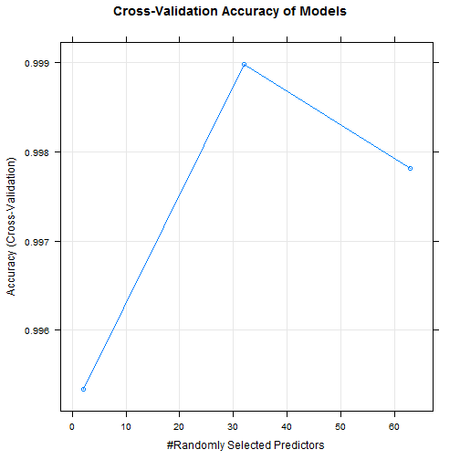
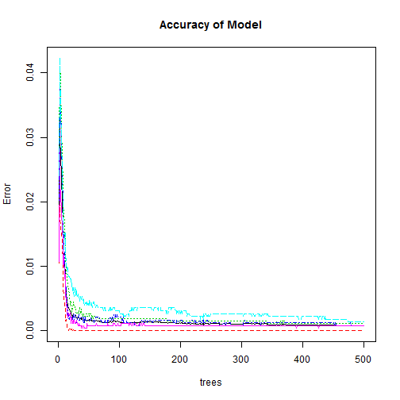

Exercise prediction
========================================================

# Summary
In the following document, I developed a model to predict the exercise behavior from the pml-training.csv file and tested it using the pml-testing.csv file. First, I examine the file, looking for features that have at least 1 factor (since a feature with only 1 level would not add to any model). Then I use the impute function from the e1071 package to replace missing data with the median value in that feature. Then I split pml-training into a training set and a testing set. Lastly, I develop a model from the training set using the random forest method with cross-validation. I validate the model using the testing set to determine out-of-sample performance.


```
## randomForest 4.6-7
## Type rfNews() to see new features/changes/bug fixes.
```

# Load and Preprocess

```r
pml <- read.csv('pml-training.csv', na.string=c('NA','#DIV/0!'))

dropVar <- c(which(names(pml)=='kurtosis_roll_belt'):which(names(pml)=='var_yaw_belt'), which(names(pml)=='var_accel_arm'):which(names(pml)=='var_yaw_arm'), which(names(pml)=='kurtosis_roll_arm'):which(names(pml)=='amplitude_yaw_arm'), which(names(pml)=='kurtosis_roll_dumbbell'):which(names(pml)=='amplitude_yaw_dumbbell'), which(names(pml)=='var_accel_dumbbell'):which(names(pml)=='var_yaw_dumbbell'), which(names(pml)=='kurtosis_roll_forearm'):which(names(pml)=='amplitude_yaw_forearm'), which(names(pml)=='var_accel_forearm'):which(names(pml)=='var_yaw_forearm'))

pml<-pml[-dropVar]
pml$X <- NULL  # remove the indexing variable
dateTime <- data.frame(do.call(rbind, strsplit(as.character(pml$cvtd_timestamp), "[[:punct:]]|\\s"))[,c(2, 1, 3:5)])
names(dateTime) <- c('day','month','year','hour','minute')
pml$date <- as.numeric(dateTime$day)
pml$time <- as.numeric(dateTime$hour)
pml$cvtd_timestamp <- NULL  # remove the date/time variable that was replaced by day hour
```
90 features were removed because they did not have values in the test set, so would not add to the predictive ability of a model that incorporated them.

# Make training and testing sets

```r
library(caret)
set.seed(123)  # for reproducibility
inTrain <- createDataPartition(y=pml$classe, p=0.7, list=FALSE)
training <- pml[inTrain,]
testing <- pml[-inTrain,]
```
We divide the data into a training and testing set balancing on the outcome variable classe, with 70% going to the training set.

# Random Forest Modeling

```r
library(doParallel)
rCluster <- makePSOCKcluster(2)
registerDoParallel(rCluster)

tr.control = trainControl(method = 'cv', number = 10)
plmFit <- train(classe~., data=training, preProcess = 'medianImpute', method='rf', trControl=tr.control, allowParallel=TRUE)
```
In performing the modeling, I use 2 cores to speed up the calculations. I perform 10-fold cross-validation using the random forest modeling, and impute missing data using the median of the feature.


```r
# Examine best model
plot(plmFit, main = 'Cross-Validation Accuracy of Models')
```

 

```r
plot(plmFit$finalModel, main = 'Accuracy of Model')
```

 

```r
# Make predictions on the testing set to determine the accuracy of the model
accuracy <- sum(diag(table(predict(plmFit, newdata=testing), testing$classe)))/nrow(testing) * 100
```
The model has more than 99% accuracy on the training set.
The model has 99.915 out-of-sample error, using the testing set.


```r
plmtest <- read.csv('pml-testing.csv')
dateTime <- data.frame(do.call(rbind, strsplit(as.character(plmtest$cvtd_timestamp), "[[:punct:]]|\\s"))[,c(2, 1, 3:5)])
names(dateTime) <- c('day','month','year','hour','minute')
plmtest$date <- as.numeric(dateTime$day)
plmtest$time <- as.numeric(dateTime$hour)
plmtestPred <- predict(plmFit, newdata=plmtest)
```
